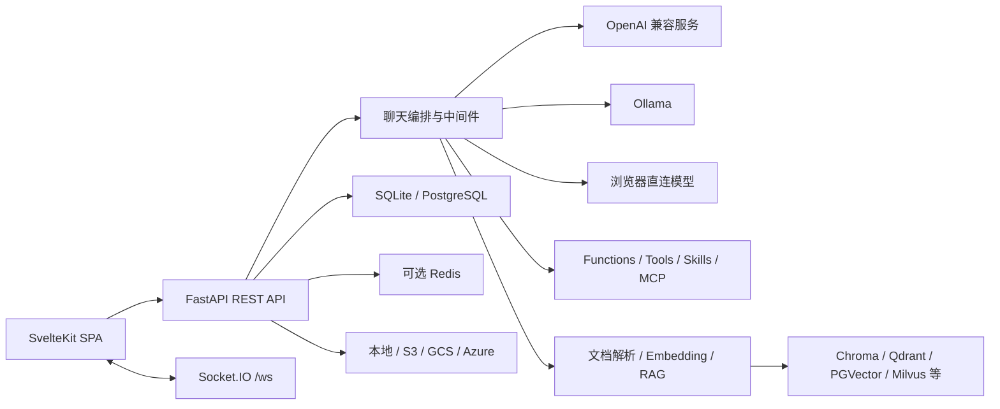
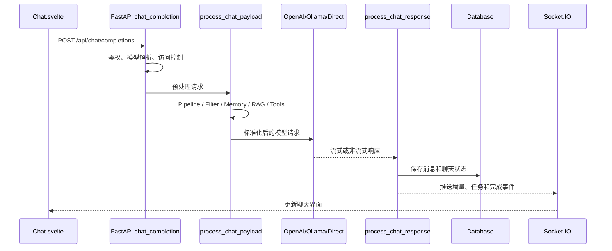

# AIOps（基于 Open WebUI）项目架构与本地启动指南

本文面向需要阅读、开发和本地运行本仓库的开发者，说明项目的主要模块、核心请求链路，以及 Windows 环境下的启动方法。

## 1. 项目定位

AIOps 是基于 Open WebUI 源码白标化的前后端同仓、统一部署 AI 对话平台。本仓库采用模块化单体架构；底层包名、Python 模块名和部分协议兼容标识仍保留原项目名称，以避免破坏升级和插件兼容性。

- 前端使用 SvelteKit 构建为静态 SPA。
- 后端使用 FastAPI 提供业务 API、模型代理、Socket.IO 和静态资源。
- 生产模式下，FastAPI 同时提供前端页面和后端接口，默认监听 `8080`。
- 默认使用 SQLite、本地文件存储和 Chroma，不要求 Redis、PostgreSQL 或独立向量数据库即可启动。



## 2. 技术栈

### 前端

- Svelte 5、SvelteKit
- TypeScript、Vite
- Tailwind CSS
- Socket.IO Client
- CodeMirror、TipTap、Mermaid、KaTeX
- Pyodide、Transformers.js、ONNX Runtime Web

前端依赖和命令定义在根目录 `package.json`。

### 后端

- Python `>=3.11,<3.13`
- FastAPI、Uvicorn
- SQLAlchemy Async、Alembic
- Pydantic
- Socket.IO
- OpenAI、Anthropic、Google GenAI SDK
- LangChain、Sentence Transformers
- Chroma 及多种可选向量数据库客户端

后端依赖定义在根目录 `pyproject.toml`，锁定版本记录在 `uv.lock`。

## 3. 目录结构

```text
open-webui/
├─ src/                         SvelteKit 前端源码
│  ├─ routes/                  页面和路由
│  └─ lib/
│     ├─ apis/                 后端 API 客户端
│     ├─ components/           UI 与业务组件
│     ├─ stores/               Svelte 全局状态
│     ├─ workers/              Pyodide、语音等 Web Worker
│     └─ utils/                前端通用工具
├─ backend/open_webui/         FastAPI 后端源码
│  ├─ main.py                  应用入口和聊天主接口
│  ├─ routers/                 领域 HTTP Router
│  ├─ models/                  SQLAlchemy 表和 Repository
│  ├─ utils/                   聊天、插件、鉴权等核心逻辑
│  ├─ retrieval/               文档解析、Embedding、向量检索
│  ├─ socket/                  Socket.IO
│  ├─ storage/                 文件存储抽象
│  ├─ migrations/              数据库迁移
│  └─ tools/                   内置工具
├─ static/                     前端静态源文件和 Pyodide 资源
├─ build/                      SvelteKit 构建产物
├─ test/                       后端测试
├─ docs/                       项目文档
├─ package.json                前端依赖与脚本
├─ pyproject.toml              Python 包与依赖
└─ uv.lock                     Python 依赖锁文件
```

## 4. 前端架构

`src/routes` 使用 SvelteKit 文件路由：

- `(app)/c/[id]`：聊天页面。
- `(app)/workspace`：模型、知识库、提示词、Skills、Tools。
- `(app)/admin`：用户、连接、模型和系统配置。
- `(app)/channels`：频道与协作。
- `(app)/notes`：笔记。
- `(app)/calendar`、`(app)/automations`：日历和自动化。
- `auth`：登录和注册。

`src/lib/stores/index.ts` 保存用户、模型、Socket、配置、工具和当前聊天等全局状态。`src/lib/apis` 按领域封装后端请求。

根布局负责：

1. 获取后端配置。
2. 恢复登录用户。
3. 建立 `/ws/socket.io` 连接。
4. 注册聊天事件、通知和连接状态处理。

生产构建使用静态适配器，输出到根目录 `build`，FastAPI 会把该目录作为 SPA 挂载。

## 5. 后端架构

`backend/open_webui/main.py` 创建 FastAPI 应用并挂载：

- `/api/v1/*`：用户、聊天、模型、知识库、文件、工具等业务接口。
- `/api/chat/completions`：WebUI 使用的聊天完成接口。
- `/openai/*`：OpenAI 兼容上游代理。
- `/ollama/*`：Ollama 上游代理。
- `/ws`：Socket.IO。
- `/static`：后端静态资源。
- `/health`、`/ready`、`/health/db`：健康检查。
- `/`：构建后的前端 SPA。

`lifespan` 负责启动和关闭阶段的资源初始化。数据库、模型列表、插件、调度任务和共享状态均在后端进程内协调。

## 6. 聊天请求链路



主要调用顺序：

1. `src/lib/components/chat/Chat.svelte` 构造模型、消息、文件、Tools、Skills、会话和后台任务参数。
2. `src/lib/apis/openai/index.ts` 请求 `/api/chat/completions`。
3. `backend/open_webui/main.py::chat_completion` 执行鉴权、模型解析和访问控制。
4. `backend/open_webui/utils/middleware.py::process_chat_payload` 依次处理 Pipeline、Filter、Memory、Web Search、代码解释器、Tools 和文件上下文。
5. `backend/open_webui/utils/chat.py::generate_chat_completion` 路由到 Direct、OpenAI 或 Ollama。
6. `process_chat_response` 解析响应、持久化消息并发送 Socket 事件。
7. 完成后执行 Pipeline 或 Function outlet filters。

## 7. 数据和扩展机制

### 关系数据库

- 默认：`backend/data/webui.db`，SQLite。
- 可选：PostgreSQL 等 SQLAlchemy 支持的数据库。
- 迁移：Alembic，在后端启动阶段执行。
- 聊天保留 JSON 消息树，同时将消息写入独立消息表。

### 文件存储

通过 `backend/open_webui/storage/provider.py` 抽象：

- Local
- S3
- Google Cloud Storage
- Azure Blob Storage

默认使用本地存储。

### 向量数据库

通过 `backend/open_webui/retrieval/vector/factory.py` 选择实现。默认使用 Chroma，还支持 Qdrant、Milvus、PGVector、OpenSearch、Elasticsearch、Pinecone、S3 Vector 等。

### 扩展

- Functions：动态加载的 Python 过滤器或动作。
- Tools：向模型暴露的可调用工具。
- Skills：注入聊天上下文的技能说明。
- Pipelines：远程 inlet/outlet 过滤链。
- MCP：通过 MCP Client 读取外部工具定义并接入统一工具调用。

## 8. 本地启动需要什么

### 必需

- Windows 10/11。
- Python 3.11 或 3.12；Python 3.13 不受支持。
- Node.js `>=18.13`。
- npm。
- 首次安装时可访问 Python 与 npm 包源。
- 首次完整构建建议至少 8 GB 可用内存；Vite 构建需要提高 Node 堆上限。

### 默认不需要

- GPU。
- Docker。
- Redis。
- PostgreSQL。
- 单独部署 Chroma。
- Ollama 或 OpenAI Key。

没有配置模型提供商时，WebUI 可以启动，但不能进行模型推理。

### 推荐但非必需

- `uv`：按 `uv.lock` 快速同步 Python 依赖。
- Ollama：本地模型推理。
- OpenAI 兼容服务及 API Key：远程模型推理。

`uv` 不是必须的运行时。选择它是因为仓库提供了 `uv.lock`，可一次性复现约 260 个锁定依赖并正确处理平台轮子；也可以只用 Python 自带的 `venv + pip` 安装，但需要自行保证依赖版本一致。服务实际启动时只使用 `.venv` 中的 Python，不依赖 `uv` 常驻。

### 官方 Quick Start 与本文方案的区别

[官方 Quick Start](https://docs.openwebui.com/getting-started/quick-start) 面向安装和使用已发布版本，本文主要面向开发和运行当前检出的仓库源码。

| 方案 | 实际运行内容 | 使用当前仓库代码 | 需要前端构建 |
| --- | --- | --- | --- |
| 官方 Docker | 官方预构建镜像 | 否 | 否 |
| 官方 `pip install open-webui` | PyPI 发布包 | 否 | 否，wheel 已包含前端 |
| 官方 `uvx ... open-webui@latest serve` | 临时环境中的最新 PyPI 包 | 否 | 否 |
| 本文源码方案 | 当前分支的 `src` 和 `backend` | 是 | 是 |

官方 Windows `uvx` 示例是：

```powershell
$env:DATA_DIR = 'C:\open-webui\data'
uvx --python 3.11 open-webui@latest serve
```

这里的 `uvx` 类似一次性安装并运行已发布应用。本文使用的 `uv sync --no-install-project --no-dev` 只是把当前仓库 `uv.lock` 中的 Python 依赖同步到 `.venv`，并不负责启动服务，也不会让 `uv` 成为应用的运行时依赖。

选择建议：

- 只想使用 Open WebUI：优先官方 Docker，其次是 `pip install open-webui`。
- 需要调试或修改当前仓库：使用本文的源码安装、前端构建和 Uvicorn 启动方式。
- 需要验证当前分支行为：不要用 `open-webui@latest` 或官方镜像代替，因为它们不包含尚未发布的本地代码。

## 9. Windows 首次安装

以下命令均在项目根目录执行。

### 9.1 检查版本

```powershell
python --version
node --version
npm --version
uv --version
```

Python 必须是 3.11 或 3.12。

### 9.2 创建虚拟环境

如果 `.venv` 不存在：

```powershell
python -m venv .venv
```

如果虚拟环境缺少 pip：

```powershell
.venv\Scripts\python.exe -m ensurepip --upgrade
```

### 9.3 同步 Python 依赖

推荐使用仓库锁文件：

```powershell
uv sync --no-install-project --no-dev
```

这里使用 `--no-install-project` 是为了只安装后端依赖，不触发 Python 包构建钩子中的前端安装。源码通过后续的 `PYTHONPATH` 直接加载。

官方的一体化安装方式是：

```powershell
.venv\Scripts\python.exe -m pip install -e .
```

该命令会调用 `hatch_build.py`，自动执行 `npm install --force` 和 `npm run build`。首次执行时间较长，并会安装 Cypress 等开发依赖。

#### 当前 Windows 环境的 PyTorch 处理

仓库锁文件原本会安装 PyTorch `2.12.1+cpu`。在本机 Windows `10.0.26200` 上该版本加载 `c10.dll` 时出现 `WinError 1114`，因此当前虚拟环境使用用户放在 `E:\dependency` 的 Windows CPU 轮子：

```powershell
uv pip install --no-cache --no-deps --reinstall `
  --python .venv\Scripts\python.exe `
  E:\dependency\torch-2.8.0-cp311-cp311-win_amd64.whl
```

验证：

```powershell
.venv\Scripts\python.exe -c "import torch; print(torch.__version__); print(torch.__file__)"
```

本机结果为 `2.8.0+cpu`，后端已能正常加载 Embedding 模型并启动。PyTorch 不是前端页面本身的必需下载项，但当前后端默认启用了本地 Embedding/RAG 组件，因此完整源码启动需要一个可导入的 PyTorch。再次执行完整 `uv sync` 可能按锁文件改回 `2.12.1+cpu`，届时需要重新安装上述轮子。

### 9.4 安装和构建前端

```powershell
npm install --force
npm run pyodide:fetch
node --max-old-space-size=8192 node_modules\vite\bin\vite.js build
```

说明：

- `pyodide:fetch` 会下载浏览器端 Python 及科学计算包，首次执行耗时较长。
- 本项目模块较多，Node 默认堆上限可能在 `rendering chunks` 阶段触发内存不足，因此构建命令显式使用 8 GB 堆。
- 成功标志是根目录出现 `build/index.html`。
- Svelte 可访问性、自闭合标签和未使用导入警告是当前代码已有警告，不会阻止构建。

### 9.5 启动后端

开发模式下从源码启动：

```powershell
$env:PYTHONPATH = (Resolve-Path backend).Path
$env:WEBUI_SECRET_KEY = .venv\Scripts\python.exe -c "import secrets; print(secrets.token_urlsafe(48))"
.venv\Scripts\python.exe -m uvicorn open_webui.main:app `
  --host 127.0.0.1 `
  --port 8080 `
  --loop asyncio
```

`WEBUI_SECRET_KEY` 是启用登录时的硬性要求。上面的写法只对当前 PowerShell 会话有效；服务重启后原有登录 Cookie 会失效。长期本地使用应把一个固定随机值保存在安全位置，并在启动前加载。

如果已经通过 `pip install -e .` 安装了项目，可以使用自动生成并保存密钥的 CLI：

```powershell
.venv\Scripts\open-webui.exe serve --host 127.0.0.1 --port 8080
```

仓库还提供 `backend/start_windows.bat`，但脚本自身注明更推荐在 WSL 中使用 `start.sh`。Windows 原生开发优先使用上面的 PowerShell 命令。

## 10. 启动验证

浏览器访问：

```text
http://127.0.0.1:8080
```

PowerShell 健康检查：

```powershell
Invoke-RestMethod http://127.0.0.1:8080/health
Invoke-RestMethod http://127.0.0.1:8080/ready
Invoke-RestMethod http://127.0.0.1:8080/health/db
```

预期 `/health` 返回包含 `status: true` 的 JSON。

首次访问时注册的第一个账号通常成为管理员。默认数据库和上传数据位于 `backend/data`。

## 11. 接入模型

### Ollama

默认后端地址：

```text
http://localhost:11434
```

启动 Ollama 并下载模型后，可以在 WebUI 管理界面中检查连接；也可以在 `.env` 中设置：

```dotenv
OLLAMA_BASE_URL='http://localhost:11434'
```

### OpenAI 兼容接口

可在管理界面配置连接，或在 `.env` 中设置：

```dotenv
OPENAI_API_BASE_URL='https://example.com/v1'
OPENAI_API_KEY='replace-with-your-key'
```

不要把真实 API Key 提交到 Git。

## 12. 日常启动

完成首次依赖安装和前端构建后，只需：

```powershell
$env:PYTHONPATH = (Resolve-Path backend).Path
$env:WEBUI_SECRET_KEY = '使用首次启动时保存的固定随机值'
.venv\Scripts\python.exe -m uvicorn open_webui.main:app `
  --host 127.0.0.1 `
  --port 8080 `
  --loop asyncio
```

只有前端源码发生变化时才需要重新执行 Vite 构建；只有 Python 依赖变化时才需要重新执行 `uv sync`。

## 13. 常见问题

### `No module named pip`

```powershell
.venv\Scripts\python.exe -m ensurepip --upgrade
```

### `WEBUI_SECRET_KEY is not set`

直接调用 Uvicorn 时必须设置：

```powershell
$env:WEBUI_SECRET_KEY = .venv\Scripts\python.exe -c "import secrets; print(secrets.token_urlsafe(48))"
```

### Vite `JavaScript heap out of memory`

使用项目构建钩子等价的 8 GB 堆：

```powershell
node --max-old-space-size=8192 node_modules\vite\bin\vite.js build
```

### `fatal: detected dubious ownership`

这是 Git 所有权检查，不影响 Vite 生成前端资源。执行 Git 命令时可对当前命令显式声明仓库：

```powershell
git -c safe.directory=E:/Project/open-webui status
```

如需永久调整 Git 全局配置，应由开发者确认后自行操作。

### npm 安装停在 Cypress

Cypress 只用于端到端测试，不参与 WebUI 运行。网络较慢时，其二进制下载可能耗时较长。不要删除已经下载的 `node_modules`；先查看 npm 日志确认状态，再决定是否重试安装。

### 可以启动但没有模型

WebUI 本身不会自动提供推理模型。需要至少配置一个 Ollama 或 OpenAI 兼容连接。

### 修改了后端但没有生效

开发时可以给 Uvicorn 增加 `--reload`。不要在多 worker 模式下同时启用 reload：

```powershell
.venv\Scripts\python.exe -m uvicorn open_webui.main:app `
  --host 127.0.0.1 `
  --port 8080 `
  --loop asyncio `
  --reload
```

## 14. 维护注意事项

聊天功能横跨以下层次：

- `Chat.svelte` 的前端消息树和请求参数。
- `main.py` 的鉴权、模型解析和任务管理。
- `utils/middleware.py` 的上下文、Tools、Filters 和流式响应。
- Provider Router 的请求格式转换。
- 聊天和消息表的持久化。
- Socket.IO 事件。

修改聊天能力时应同时核对这些层次，避免只修改 REST 返回却遗漏数据库或 Socket 状态。

## 15. AIOps 白标与 Chrome 108 兼容约束

本分支的产品展示规则如下：

- 页面标题、登录/首次引导、通知标题、关于页、站点清单和搜索描述统一显示 `AIOps`。
- 浏览器图标、登录页、启动图和 PWA 图标统一使用 `static/static/favicon.png` 对应的 AIOps Logo。
- 前端不展示上游文档、版本发布、社区分享、赞助/企业推广和自动更新入口。
- 后端公开配置固定返回 `enable_community_sharing: false` 和 `enable_version_update_check: false`，避免已有数据库配置重新打开相关入口。
- `vite.config.ts` 的生产目标固定为 `chrome108`。升级 Vite、Svelte、Tailwind 或引入新浏览器 API 后，必须再次使用指定旧内核做回归。

指定测试环境：

```text
Playwright: E:\Playwright\1.28.1
Chromium:   108.0.5359.29
```

2026-07-31 的本机验收结果：

- 生产构建成功，输出到 `build`。
- `/health` 返回 `status: true`。
- 登录前和登录后的页面标题均为 `AIOps`，Logo 资源尺寸和加载状态正常。
- 管理员注册、登录、聊天首页、系统设置、用户管理、模型/知识库工作区可在 Chromium 108 打开。
- 用户可见页面未出现 `Open WebUI`、社区、企业版或赞助推广文案。
- API 验证名称为 `AIOps`，社区分享和版本更新检查均为关闭状态。
- Chrome 108 不支持 `oklch()` 和 `color-mix()`；当前构建已对颜色提供可用回退，实际页面布局与主要颜色显示正常。

浏览器回归截图位于 `output/playwright/`。测试生成的本地管理员账号仅用于当前开发数据库，不应作为生产账号或密码模板。
